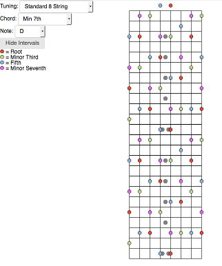

## Guitar Chord Trainer

Lets the user find chords over the fretboard of guitars or other fretted instruments in any tuning, and colors the notes
by interval.

### To-Do

1. Let user set up their own tunings in addition to the ones provided (done in backend; all tunings are just arrays of
   base notes, only need to create UI component to dynamically create the user's own array)
2. Enable support for various altered chords (done in backend, working out common notes included in chords as played vs.
   pure theory, to cut down on clutter)
3. Find specific chords & quiz on location based on base note, inversion, position on fret board, etc. (some work done
   on backend, but will likely require rewriting some of the core classes)
