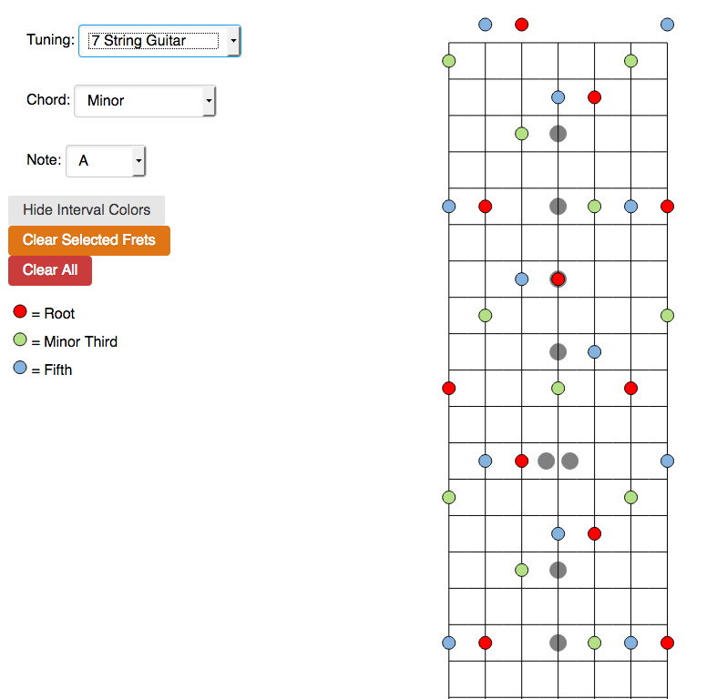

## Guitar Chord Trainer 
Link here: [https://nomicflux.github.io/GuitarChordTrainer]

Lets the user find chords over the fretboard of guitars or other fretted instruments in any tuning, and colors the notes
by interval.

### Usage

* Select tuning / instrument, base note, & chord  to show the positions of the notes in the chord.
* Interval colors are turned on by default.  Click "Hide Interval Colors" to just show Red for the base note and Black
  for others.
* Click on the interval names in the sidebar to hide / show that interval on the fretboard. 
* Click on the fretboard to filter available chords to only those which include the given notes. 

### To-Do

1. Let user set up their own tunings in addition to the ones provided (done in backend; all tunings are just arrays of
   base notes, only need to create UI component to dynamically create the user's own array)
2. Improve UI for chord filtering
3. Find specific chords & quiz on location based on base note, inversion, position on fret board, etc. (some work done
   on backend, but will likely require rewriting some of the core classes)
